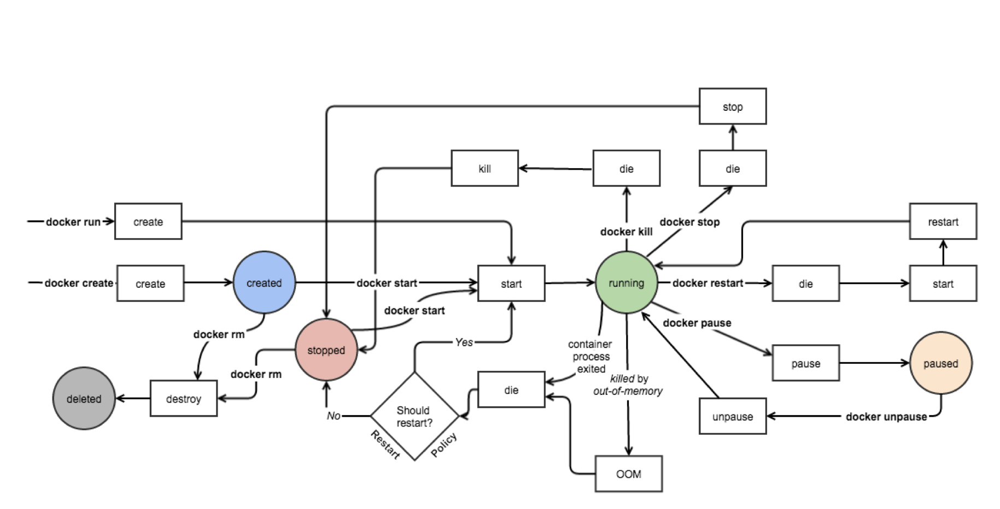

[Docker 简明实践](https://abelsu7.top/2019/03/14/docker-quick-guides/#8-%E4%B8%BA%E5%AE%B9%E5%99%A8%E9%85%8D%E7%BD%AE%E7%BD%91%E7%BB%9C)
Nickoloff, Jeff, Stephen Kuenzli 和 Bret Fisher. Docker in action. Second edition. Shelter Island, NY: Manning Publications Co, 2019.

# INTRO

> **A best practice** is an optional investment in your product or system that should yield better outcomes in the future. Best practices enhance security, prevent conflicts, improve serviceability, or increase longevity.

> Docker is a tool that makes adopting software packaging, distribution, and utilization best practices **cheap and sensible defaults**

# 基本概念

image,container,network,volumn

docker daemon,cml

container life cycle

**Copy on right**[^1]
[^1]:换言之，容器在创建和启动的过程中，不需要进行任何的文件系统复制操作，也不需要为容器单独开辟大量的硬盘空间，Docker 容器的启动速度也由此得到了保障

## Controlling containers: Building a website monitor

```bash
ubuntu@VM-4-5-ubuntu:~$ docker run --detach --name web nginx:latest
docker run -d --name mailer dockerinaction/ch2_mailer
docker run --iterative --tty --name web_test --link web:web busybox:1.29 /bin/sh
```

**detach ,daemon and service**[^2]
[^2]:Running detached containers is a perfect fit for programs that sit quietly in the background. **That type of program is called a daemon, or a service.** A daemon generally interacts with other programs or humans over a network or some other communication channel. When you launch a daemon or other program in a container that you want to run in the background, remember to use either the --detach flag or its short form, -d.

# docker 安装

## install

```bash
# 安装常用工具包
sudo apt update
sudo apt install apt-transport-https ca-certificates curl gnupg-agent software-properties-common
# 添加docker公钥为信任
curl -fsSL https://download.docker.com/linux/ubuntu/gpg | sudo apt-key add -
# 添加下载源
sudo add-apt-repository "deb [arch=amd64] https://download.docker.com/linux/ubuntu $(lsb_release -cs) stable"
# 安装docker
sudo apt update
sudo apt install docker-ce docker-ce-cli containerd.io：
# 查看docker状态
sudo systemctl status docker

...
```

## config

```bash
$ sudo systemctl enable docker
$ sudo systemctl start docker

sudo groupadd docker
sudo usermod -aG docker $USER

# more about group
groups username # 查看用户组
less /etc/group # 所有组
groupdel groupname
```

## Hello from docker!

```bash
ubuntu@VM-4-5-ubuntu:~$ docker run -rm hello-world

Hello from Docker!
This message shows that your installation appears to be working correctly.
...
```

## ubuntu 换源下载

```bash
sudo cp /etc/apt/sources.list /etc/apt/sources.list_backup
# 添加下面文件
# 阿里源
deb http://mirrors.aliyun.com/ubuntu/ bionic main restricted universe multiverse
deb http://mirrors.aliyun.com/ubuntu/ bionic-security main restricted universe multiverse
deb http://mirrors.aliyun.com/ubuntu/ bionic-updates main restricted universe multiverse
deb http://mirrors.aliyun.com/ubuntu/ bionic-proposed main restricted universe multiverse
deb http://mirrors.aliyun.com/ubuntu/ bionic-backports main restricted universe multiverse
deb-src http://mirrors.aliyun.com/ubuntu/ bionic main restricted universe multiverse
deb-src http://mirrors.aliyun.com/ubuntu/ bionic-security main restricted universe multiverse
deb-src http://mirrors.aliyun.com/ubuntu/ bionic-updates main restricted universe multiverse
deb-src http://mirrors.aliyun.com/ubuntu/ bionic-proposed main restricted universe multiverse
deb-src http://mirrors.aliyun.com/ubuntu/ bionic-backports main restricted universe multiverse

sudo apt-get update
sudo apt-get upgrade
sudo apt-get install build-essential
```

## 配置国内镜像

```bash
sudo mkdir -p /etc/docker
sudo tee /etc/docker/daemon.json <<-'EOF'
{
  "registry-mirrors": ["https://nmppymjm.mirror.aliyuncs.com"]
}
EOF

sudo systemctl daemon-reload
sudo systemctl restart docker
# Aliyun申请来的镜像加速地址
# daemon-reload Reload systemd manager configuration

```

# 基本操作

## images

```bash
docker images # show
docker pull openresty/openresty:1.13.6.2-alpine
docker search ubuntu
docker inspect centos | less
docker rmi centos # docker rm centos1之后操作
```

## container

> 5 Stutus of container: **created,running,paused,stopped,deleted**.

```bash
docker create -d nginx
docker start nginx
docker run --name mynginx -d nginx:latest
docker rm -f containername # 不推荐

docker ps -a -n 4
docker ps --format "table {{.ID}}\t{{.Names}}\t{{.Ports}}\t{{.Status}}" # 有时屏幕不够宽会导致内容错开，有必要alias

docker exec nginx more /etc/hostname
docker exec -it nginx bash
docker attach nginx # 似乎有点问题，没输出
Ctrl + P + Q # 在交互模式下使用组合键退出容器，但保持容器继续运行。
```

## docker logs

> The **docker logs** command can be helpful for these cases but is dangerous to rely on. Anything that the program writes to the stdout or stderr output streams will be recorded in this log. The problem with this pattern is that the log is never rotated or truncated by default, so the data written to the log for a container will remain and grow as long as the container exists.

> That long-term persistence can be a problem for long-lived processes. A better way to work with log data uses volumes and is discussed in chapter 4

> 数据卷操作
> docker rm \_v <container>
> docker volume prune

## 网络操作

> 5 drivers: bridge,host,overlay,maclan,none

```bash
docker run -d --name mysql -e MYSQL_RANDOM_ROOT_PASSWORD=yes mysql --expose 13306 --expose 23306 mysql:5.7
docker run -d --name webapp --link mysql webapp:latest

# network
docker run -d -name webapp --link mysql:database webapp:latest # 别名
docker network create -d bridge networkname
docker network ls


docker run -d --name mysql -e MYSQL_RANDOM_ROOT_PASSWORD=yes --network networkname mysql:5.7 # --network
docker run -d --name nginx -p 80:80 -p 443:443 nginx:1.12 # --publish

```

暴露端口可以通过 Docker 镜像定义，也可以在容器创建时通过--expose 选项进行定义
-publish 指的是端口映射
使用别名（？）
网络创建，查看容器网络，查看所有网络

## 挂载方式

> 基于底层存储实现，Docker 提供了三种适用于不同场景的文件系统挂载方式：**Bind Mount、Volume 和 Tmpfs Mount**。
> Bind Mount: 能够直接将宿主机操作系统中的目录和文件挂载到容器内的文件系统中，需要同时指定容器内、外的路径。**在容器内外对文件读写，都是相互可见的**.
> Volume：也是从宿主机操作系统中挂载目录到容器，只不过这个**挂载的目录由 Docker 进行管理**，我们只需要指定容器内的目录即可
> Tmpfs Mount：支持挂载系统内存的中的一部分到容器的文件系统里，不过存储并不是持久的，其中的**内容会随着容器的停止而消失**.

> bind mount volume 的区别
> :ro
> volume 和 bind mount 只是写法的区别，前加 volumn 名字（或者不加）就是 volume，后加目录就是 bindmount
> 共用数据卷
> 由于数据卷的命名在 Docker 中是唯一的，因此可以很方便的让多个容器挂载同一个数据卷：

## dockerfile

### 合并指令

> 看似连续的镜像构建过程，其实是由多个小段组成的。**每当一条能够形成对文件系统改动的指令在被执行前，Docker 先会基于上条命令的结果启动一个容器，在容器中运行这条指令的内容，之后将结果打包成一个镜像层**，如此反复，最终形成镜像因此，绝大多数镜像会将命令合并到一条指令中，因为这样不但减少了镜像层的数量，也减少了镜像构建过程中反复创建容器的次数，提高了镜像构建的速度。

### 利用构建缓存

基于这个原则，我们在条件允许的前提下，更建议将不容易发生变化的搭建过程放到 Dockerfile 的前部，充分利用构建缓存提高镜像构建的速度。
另外，指令的合并也不宜过度，而是将易变和不易变的过程拆分，分别放到不同的指令里。

## dockercompose

如果说 Dockerfile 是将容器内运行环境的搭建固化下来，那么 Docker Compose 就可以理解为将多个容器运行的方式和配置固化下来。

env 变量，arg 变量设置
from，entrypoint，run，
dockerfile(image,containner,)

# Q1

# ubuntu

apt update：更新包缓存（可以知道包的哪些版本可以被安装或升级）
apt upgrade：升级包到最新版本
